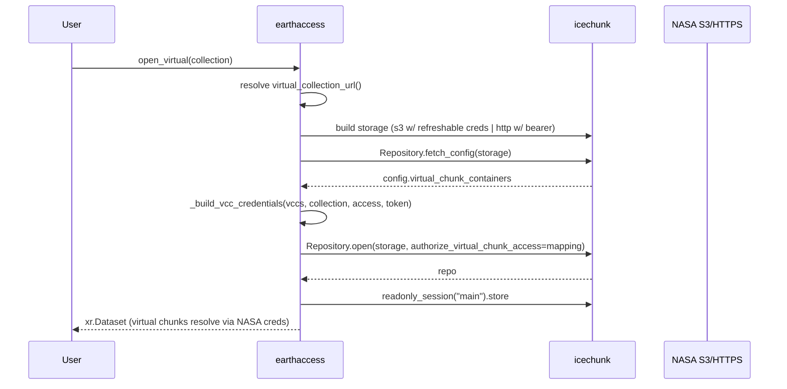
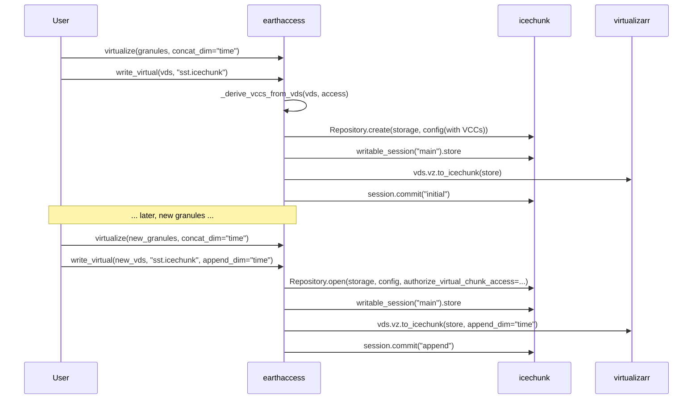

# Implementation Plan: Icechunk Virtual Chunk Container (VCC) Support

> Status: **DRAFT — awaiting review**
>
> This document describes how we will add Virtual Chunk Container (VCC)
> authorization and icechunk read/write/append workflows to `earthaccess`.
> It is written so we can compare it against the code as we refactor.
> Development follows TDD: we write the high-level tests first, then the
> implementation, then run the full lint/type/test suite.

---

## 1. Background & motivation

An Icechunk repository can contain *virtual chunks* — pointers to byte ranges in
external storage (`s3://`, `http(s)://`, `file://`, …). Icechunk is secure by
default: a reader must explicitly authorize each *Virtual Chunk Container*
(VCC) via `Repository.open(..., authorize_virtual_chunk_access={...})`, and the
repo writer must declare the VCCs in the repo config.

Today `earthaccess.open_virtual()` opens Icechunk stores **without** any
`authorize_virtual_chunk_access`, so:

1. Repos containing virtual chunks fail to resolve those chunks.
2. We cannot open NASA stores whose VCCs point at other NASA buckets/URLs.
3. We cannot *write* or *append* virtual datasets to an Icechunk store.

This plan adds:

- Automatic VCC authorization when **opening** Icechunk stores (HTTP or S3,
  from a `DataCollection` or a plain URI / local path).
- A new top-level `write_virtual()` function to **create and append** virtual
  datasets in an Icechunk store.
- An example notebook and documentation.

Reference material:

- <https://www.earthmover.io/blog/secure-virtual-chunks> (VCC design rationale)
- <https://icechunk.io/en/stable/guides/virtual/> (VCC + `authorize_virtual_chunk_access`)
- <https://github.com/earth-mover/icechunk/pull/2143> (HTTP header support)

---

## 2. Terminology

| Term | Meaning |
| --- | --- |
| VCC | Virtual Chunk Container — a `url_prefix` + storage backend declared by a repo writer and authorized by a repo reader. |
| `authorize_virtual_chunk_access` | Dict `{url_prefix: credential}` passed to `Repository.open`/`create`. |
| Credential | `S3Credentials.{Static,Anonymous,FromEnv,Refreshable}`, `GcsCredentials.*`, `AzureCredentials.*`, or the no-auth sentinels `HttpAccess` / `LocalFileSystemAccess`. |
| ManifestArray | VirtualiZarr's lazily-referenced array; `vds.vz.to_icechunk()` writes these as virtual refs. |
| VDS | A "Virtual Dataset" — an `xr.Dataset` with `ManifestArray` variables. |

---

## 3. Current state (what we are changing)

`earthaccess/virtual/core.py` currently contains:

```python
def _open_icechunk(uri, storage_options=None, access="indirect", **kwargs):
    # builds icechunk storage (s3/http/local)
    repo = icechunk.Repository.open(storage=storage)          # <-- no VCC auth
    session = repo.readonly_session("main")
    return xr.open_zarr(session.store, **kwargs)

def _open_icechunk_from_collection(collection, url, access="indirect", **kwargs):
    # builds storage (s3_storage w/ refreshable creds | redirect_storage)
    repo = icechunk.Repository.open(storage=storage)          # <-- no VCC auth
    session = repo.readonly_session("main")
    return xr.open_zarr(session.store, **kwargs)
```

Also relevant:

- `_credentials.py` — `build_obstore_registry`, `get_granule_credentials_endpoint_and_region`.
- `results.py` — `DataCollection.get_s3_credentials()`, `DataGranule.get_s3_credentials_endpoint()`.
- `_parser.py` — `get_urls_for_parser()` returns the granule URLs.

---

## 4. icechunk 2.1 API surface we rely on

```python
import icechunk as ic

# discover VCCs without opening
config = ic.Repository.fetch_config(storage)            # RepositoryConfig | None
vccs = config.virtual_chunk_containers                  # dict[str, VirtualChunkContainer]
# VirtualChunkContainer has: .url_prefix (str), .name (str|None), .store (ObjectStoreConfig)

# authorize at read time
repo = ic.Repository.open(
    storage=storage,
    authorize_virtual_chunk_access={
        "s3://bucket/":    ic.s3_credentials(get_credentials=lambda: ic.S3StaticCredentials(...)),
        "https://host/":   ic.credentials.HttpAccess,
        "file:///path/":   ic.credentials.LocalFileSystemAccess,
    },
)

# write (VCC store config carries optional headers for HTTP)
vcc = ic.VirtualChunkContainer("https://host/", ic.http_store(headers={"Authorization": "Bearer ..."}))
config.set_virtual_chunk_container(vcc)
```

Key facts confirmed against the installed `icechunk==2.1.2`:

- `Repository.open(storage, config=None, authorize_virtual_chunk_access=None)`.
- `Repository.fetch_config(storage)` → `RepositoryConfig | None`.
- `virtual_chunk_containers` returns a dict keyed by `url_prefix`.
- `http_store(headers=...)` / `http_storage(url, headers=...)` support static
  headers (PR #2143) — used to inject the EDL bearer token for NASA HTTPS VCCs.
- `HttpAccess` / `LocalFileSystemAccess` are no-arg sentinels; `None` is deprecated.

---

## 5. Target API

### 5.1 `open_virtual` (read) — extended

```python
def open_virtual(
    uri: str | Path | earthaccess.DataCollection,
    *,
    access: str = "indirect",
    storage_options: dict[str, Any] | None = None,
    force_external: bool = False,
    load: bool = True,
    authorize_virtual_chunk_access: dict[str, Any] | None = None,  # NEW
    **kwargs: Any,
) -> xr.Dataset:
    ...
```

- `authorize_virtual_chunk_access` mirrors Icechunk's parameter. When given, it
  is **merged over** the auto-detected VCC mapping (explicit keys win). This is
  the escape hatch for cases our auto-detection can't handle.

### 5.2 `write_virtual` (write/append) — new

```python
def write_virtual(
    vds: xr.Dataset,
    store: str | Path,
    *,
    append_dim: str | None = None,
    commit: bool = True,
    storage_options: dict[str, Any] | None = None,
) -> xr.Dataset:
    ...
```

- `vds`: a VDS (the return value of `virtualize(..., load=False)`).
- `store`: target Icechunk store location.
  - local path (no scheme, or `file://`) → `local_filesystem_storage`.
  - `s3://bucket/prefix` → `s3_storage` (write creds from `storage_options`/env).
- `append_dim`: when set, append along that dim (e.g. `"time"`) instead of
  creating a new group.
- `commit`: when `True` (default), `session.commit()` after writing.
- Returns the `vds` unchanged (chainable, mirrors `virtualize()`).

> Note (deviation from the original draft): the `access` parameter was dropped.
> The virtual chunk container backend is derived from the scheme of the VDS's
> own chunk references (`s3://` vs `https://`), so callers do not need to
> restate how the granules were virtualized.

Exported from `earthaccess.virtual` and top-level `earthaccess` (`__init__`).

### 5.3 Public surface summary

```
earthaccess.virtualize(granules, ...)     # unchanged: returns VDS
earthaccess.write_virtual(vds, store, ...)  # NEW: write/append VDS to icechunk
earthaccess.open_virtual(uri_or_collection, ..., authorize_virtual_chunk_access=...)  # extended
```

---

## 6. Workflows (diagrams)

### 6.1 Read a NASA icechunk store (collection)



### 6.2 Read a local `.icechunk` store whose VCCs point at NASA data

```mermaid
sequenceDiagram
    participant U as User
    participant EA as earthaccess
    participant IC as icechunk
    participant NASA as NASA S3/HTTPS

    U->>EA: open_virtual("/local/store.icechunk")
    EA->>IC: local_filesystem_storage(path)
    EA->>IC: Repository.fetch_config(storage)
    IC-->>EA: config.virtual_chunk_containers
    EA->>EA: _build_vcc_credentials(vccs, collection=None, access, token)
    Note over EA: s3:// -> from_env/anonymous; https:// -> HttpAccess + bearer header
    EA->>IC: Repository.open(storage, config, authorize_virtual_chunk_access=mapping)
    EA-->>U: xr.Dataset
```

### 6.3 Create + append (write workflow)



---

## 7. Internal design

### 7.1 New/updated helpers in `earthaccess/virtual/core.py`

```python
def _icechunk_storage_for_uri(
    uri: str,
    *,
    storage_options: dict[str, Any] | None,
    access: str,
    collection: earthaccess.DataCollection | None,
    for_write: bool,
) -> tuple["Storage", "RepositoryConfig | None"]:
    """Build icechunk Storage (+ optional persisted config) for a URI/collection.

    - local path            -> local_filesystem_storage(path)
    - s3:// (or access=direct)-> s3_storage(bucket, prefix, ...)
    - https:// NASA          -> http_storage(url, headers={"Authorization": bearer})
    - https:// other         -> redirect_storage(url)  (fallback)
    """

def _build_vcc_credentials(
    vccs: dict[str, Any],
    *,
    collection: earthaccess.DataCollection | None,
) -> dict[str, Any]:
    """Map each VirtualChunkContainer.url_prefix to an icechunk credential."""

def _inject_http_vcc_headers(
    config: Any,
    *,
    token: str,
) -> Any:
    """For each HTTP VCC, rebuild its store with http_store(headers=Bearer token)."""

def _authorize_vccs(
    storage: Any,
    *,
    collection: earthaccess.DataCollection | None,
    explicit: dict[str, Any] | None,
) -> tuple[Any | None, dict[str, Any]]:
    """fetch_config -> (config_with_headers, merged credential mapping)."""

def _derive_vccs_from_vds(vds: xr.Dataset) -> dict[str, Any]:
    """Collect scheme://netloc/ prefixes from the VDS ManifestArray refs."""

def _write_virtual_to_icechunk(
    vds: xr.Dataset,
    store: str,
    *,
    append_dim: str | None,
    commit: bool,
    storage_options: dict[str, Any] | None,
) -> xr.Dataset:
    """Open/create a writable icechunk store and write (or append) the VDS."""
```

### 7.2 Credential selection rules

| `url_prefix` | collection present? | credential |
| --- | --- | --- |
| `s3://…/` | yes | `s3_credentials(get_credentials=lambda: S3StaticCredentials(collection.s3_credentials))` |
| `s3://…/` | no | `s3_from_env_credentials()` (fallback `s3_anonymous_credentials()` if `anon=True` in storage_options) |
| `http(s)://…/` | n/a | `HttpAccess` sentinel (+ `http_store(headers=Bearer)` injected into config for NASA hosts) |
| `file://…/` | n/a | `LocalFileSystemAccess` sentinel |
| `vcc://name/` | n/a | resolve `name` → `store` backend → credential as above |

### 7.3 Explicit-override merge

`_authorize_vccs` returns `{**auto, **explicit}` — user-supplied keys always win.

---

## 8. Cached S3 credentials (`earthaccess/results.py`)

```python
from functools import cached_property

class DataCollection(CustomDict):
    @cached_property
    def s3_credentials(self) -> dict[str, str]:
        """Cached temporary S3 credentials (accessKeyId/secretAccessKey/sessionToken)."""
        return self.get_s3_credentials()

class DataGranule(CustomDict):
    @cached_property
    def s3_credentials(self) -> dict[str, str]:
        """Cached S3 credentials derived from the granule's s3credentials endpoint."""
        endpoint = self.get_s3_credentials_endpoint()
        if not endpoint:
            raise ValueError("No s3credentials endpoint for this granule.")
        return earthaccess.__auth__.get_s3_credentials(endpoint=endpoint)
```

Rationale: the EDL token exchange is a network call; caching avoids repeated
calls across the open/write path. `CustomDict` has a normal `__dict__`, so
`cached_property` works.

---

## 9. TDD plan (high-level tests)

We write tests at the *behavior* level — one test per workflow/scenario, not
per arithmetic operation. All icechunk/xarray/network I/O is mocked.

### 9.1 `tests/unit/test_virtual.py` (extend `TestOpenIcechunk` + new classes)

| Test (behavior) | Assertion |
| --- | --- |
| `open_virtual(collection)` authorizes every VCC | `Repository.open` called with `authorize_virtual_chunk_access` covering all `fetch_config` prefixes |
| NASA S3 VCC uses refreshable collection creds | S3 credential built from `collection.s3_credentials` (via `get_credentials`) |
| local `.icechunk` w/ `https://` VCC injects bearer header | config rebuilt with `http_store(headers={"Authorization": "Bearer …"})`, `HttpAccess` sentinel authorized |
| `file://` VCC authorized | `LocalFileSystemAccess` sentinel present |
| explicit `authorize_virtual_chunk_access` overrides auto | explicit key wins over auto-detected key |
| NASA HTTPS repo uses bearer headers (not redirect) | `http_storage(url, headers=…)` called for NASA URL |
| non-NASA HTTPS repo uses redirect | `redirect_storage(url)` called |

### 9.2 `tests/unit/test_virtual_write.py` (new)

| Test (behavior) | Assertion |
| --- | --- |
| `write_virtual` creates local store with VCCs | `Repository.create` (or open when exists) + `set_virtual_chunk_container` for each derived prefix; `to_icechunk` + `commit` called |
| `write_virtual(..., append_dim="time")` opens existing + appends | `Repository.open` + `to_icechunk(store, append_dim="time")` |
| `write_virtual` to `s3://` uses write storage options | `s3_storage` called with bucket/prefix + forwarded options |
| `write_virtual` returns the VDS unchanged | result is the same object |

### 9.3 Integration (network-gated, `pytest.mark.skipif` without creds)

- `open_virtual(collection)` on a NASA icechunk collection with VCCs returns a
  non-empty dataset.
- `write_virtual` → `open_virtual` round-trip on a local store for the MUR SST
  collection, then append a later temporal slice and confirm the extended
  `time` span.

### 9.4 Example notebook

`docs/tutorials/icechunk_virtual.ipynb` — MUR SST (`C1996881146-POCLOUD`),
local store → HTTP indirect:

1. `virtualize(granules_batch_1, concat_dim="time")` → `write_virtual(vds, "sst.icechunk")`.
2. `open_virtual("sst.icechunk")` → inspect `time` span.
3. `search_data(...)` later granules → `virtualize(...)` →
   `write_virtual(delta, "sst.icechunk", append_dim="time")`.
4. `open_virtual("sst.icechunk")` → extended `time` span.

---

## 10. Implementation order (each step lands with its tests)

1. **Deps**: `pyproject.toml` `icechunk>=2.1`; refresh `uv.lock` if needed.
2. **Cached creds**: `DataCollection.s3_credentials` / `DataGranule.s3_credentials` (+ unit tests).
3. **Read path VCC auth**: `_build_vcc_credentials`, `_inject_http_vcc_headers`,
   `_authorize_vccs`; wire `_open_icechunk` / `_open_icechunk_from_collection`;
   add `authorize_virtual_chunk_access` to `open_virtual` (+ unit tests).
4. **Write path**: `_derive_vccs_from_vds`, `_write_virtual_to_icechunk`,
   public `write_virtual` (+ unit tests).
5. **Exports**: `earthaccess/virtual/__init__.py` and top-level `earthaccess/__init__.py`.
6. **Notebook + docs + CHANGELOG**.
7. **Verification**: `ruff check`, `mypy`, `pytest tests/unit`, then integration tests.

---

## 11. Open questions / risks

- **NASA HTTP VCC read**: relies on `http_store(headers=…)` (icechunk ≥ 2.1).
  Confirmed working in 2.1.2; needs a `>=2.1` floor to be safe.
- **`s3://` VCC region**: derived from the collection when present; defaults to
  `us-west-2` otherwise. Non-NASA buckets may need an explicit region via
  `authorize_virtual_chunk_access` / `storage_options`.
- **Write credentials**: NASA S3 is read-only; writing to `s3://` requires the
  user's own bucket + write creds (env or `storage_options`). Local-store
  writes need no write creds (VCC data still read via EDL token).
- **`load=True` + VCCs**: only the `load=False` (VDS) path writes virtual refs;
  `write_virtual` therefore requires a VDS (`ManifestArray`-backed).

---

## 12. Definition of done

- [ ] `open_virtual` opens NASA HTTP/S3 icechunk stores (with VCCs) end-to-end.
- [ ] `open_virtual` opens local `.icechunk` stores whose VCCs point at NASA HTTP/S3.
- [ ] `write_virtual` creates and appends a VDS in a local store.
- [ ] `write_virtual` creates/appends in an S3 store given write creds.
- [ ] `authorize_virtual_chunk_access` is exposed and overrides auto-detection.
- [ ] Unit tests cover each workflow; integration tests gated on network/creds.
- [ ] Notebook + CHANGELOG updated.
- [ ] `ruff` / `mypy` / `pytest` green.
