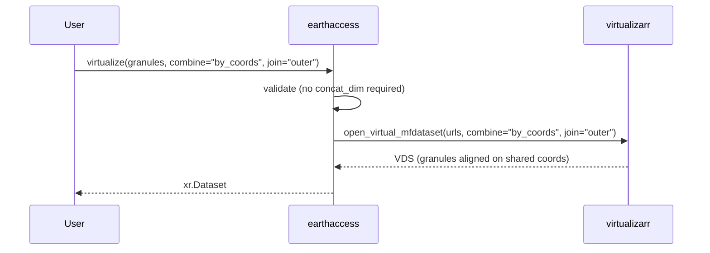
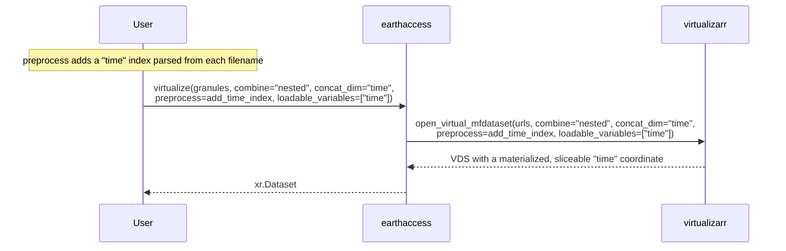
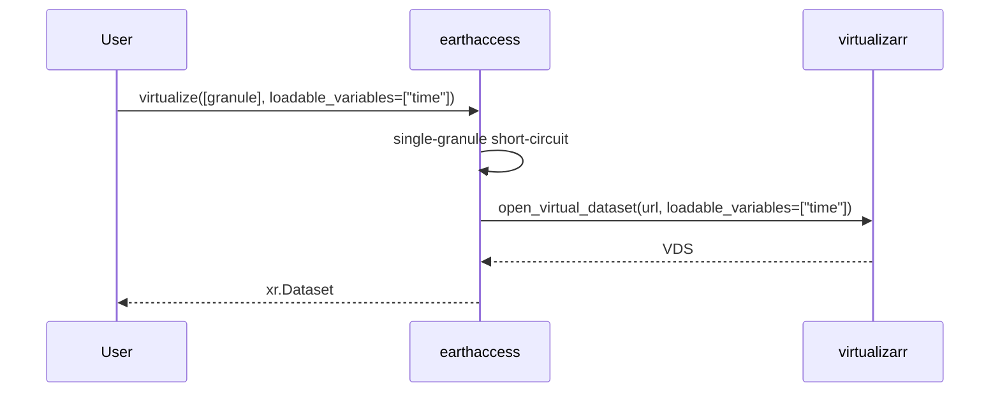
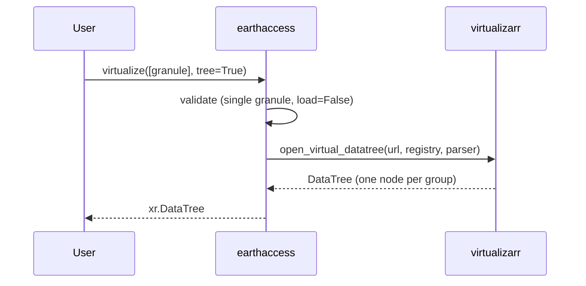

# Implementation Plan: `virtualize()` — combine strategies, single-file, and DataTree

> Status: **DRAFT — awaiting review**
>
> This document describes how we extend `earthaccess.virtualize()` to handle
> three gaps in the current implementation:
>
> 1. Datasets that **cannot be concatenated** along an existing dimension and
>    need an index (coordinates or a synthetic date/filename index).
> 2. Virtualizing a **single file** directly (today it round-trips through the
>    multi-file combine machinery).
> 3. Using VirtualiZarr's `open_virtual_datatree` to return an `xr.DataTree`.
>
> Development follows TDD: we write the high-level tests first, then the
> implementation, then run the full lint/type/test suite.

---

## 1. Background & motivation

`virtualize()` currently hardcodes `combine="nested"` and requires a
`concat_dim` whenever more than one granule is passed. This is fine for
gridded Level-4 products whose granules stack cleanly along `time`, but it
leaves three real workflows unsupported:

- **Non-concatenatable granules.** Many collections' granules do not share a
  dimension that can be `concat`ed. Instead they are aligned by their existing
  coordinates (xarray's `combine="by_coords"`), or require a *synthetic* index
  (e.g. a timestamp parsed from the filename) that does not exist in the file.
  Today these fail with `ValueError: concat_dim is required ...`.
- **Single file.** Virtualizing one granule works today only because it is
  silently routed through `open_virtual_mfdataset`, which collapses to a single
  `open_virtual_dataset` call anyway. The direct path is clearer, faster, and
  exposes `open_virtual_dataset`'s `drop_variables` / `loadable_variables`.
- **DataTree.** Some granules contain HDF5 groups (e.g. `group="product"`,
  `group="geolocation"`); a `DataTree` is the natural container for them.
  VirtualiZarr already offers `open_virtual_datatree`, but `virtualize()`
  cannot produce one.

Reference material:

- <https://docs.xarray.dev/en/stable/user-guide/io.html#combining-multiple-files>
- <https://virtualizarr.readthedocs.io/> (`open_virtual_mfdataset`,
  `open_virtual_dataset`, `open_virtual_datatree`)

---

## 2. Terminology

| Term | Meaning |
| --- | --- |
| VDS | A "Virtual Dataset" — an `xr.Dataset` with `ManifestArray` variables. |
| `combine="nested"` | Stack datasets in list order along `concat_dim` (xarray `combine_nested`). |
| `combine="by_coords"` | Align datasets on their shared coordinates (xarray `combine_by_coords`). |
| `join` | How coordinate values are combined under `by_coords`: `outer`, `inner`, `left`, `right`, `exact`, `override`. |
| `loadable_variables` | Variables VirtualiZarr loads eagerly as real arrays instead of virtual references — used to materialize index coordinates so they can be sliced. |
| Synthetic index | A coordinate/dimension injected via `preprocess` (e.g. date parsed from filename) rather than read from the file. |
| `xr.DataTree` | xarray's hierarchical container; one node per HDF5/NetCDF4 group. |

---

## 3. Current state (what we are changing)

`earthaccess/virtual/core.py`:

```python
def virtualize(granules, *, access="indirect", load=False, group="/",
               concat_dim=None, preprocess=None, data_vars="all", coords="different",
               compat="no_conflicts", combine_attrs="drop_conflicts", parallel="dask",
               parser="DMRPPParser", reference_dir=None, reference_format="json",
               **xr_combine_kwargs) -> xr.Dataset:
    if len(granules) == 0: raise ValueError(...)
    if len(granules) > 1 and concat_dim is None: raise ValueError(...)   # <-- gap 1
    ...
    vds = _open_virtual_mfdataset(...)                                    # <-- gaps 1, 2, 3
```

`_open_virtual_mfdataset` (core.py:214) hardcodes `combine="nested"` and does
not forward `loadable_variables` / `drop_variables` / `join`.

Relevant helpers that stay as-is:

- `resolve_parser(parser, group=...)` — returns a parser instance carrying the
  group path (`_parser.py`).
- `build_obstore_registry(granules, access=...)` — returns the
  `ObjectStoreRegistry` (`_credentials.py`).
- `get_urls_for_parser(granules, parser, access=...)` — returns one URL per
  granule (`_parser.py`).

---

## 4. VirtualiZarr API surface we rely on (confirmed against `virtualizarr==2.5.0`)

```python
vz.open_virtual_dataset(url, registry, parser, *,
                        drop_variables=None, loadable_variables=None, decode_times=None) -> xr.Dataset

vz.open_virtual_datatree(url, registry, parser, *,
                         loadable_variables=None, decode_times=None) -> xr.DataTree  # single url only

vz.open_virtual_mfdataset(urls, registry, parser, concat_dim=None, compat="no_conflicts",
                          preprocess=None, data_vars="all", coords="different",
                          combine="by_coords", parallel=False, join="outer",
                          attrs_file=None, combine_attrs="override", **kwargs) -> xr.Dataset
```

Key facts:

- `open_virtual_datatree` accepts a **single URL** (no `mfdatatree` variant).
- `open_virtual_mfdataset` forwards `**kwargs` (including `drop_variables` and
  `loadable_variables`) to `open_virtual_dataset`.
- With `combine="by_coords"`, passing `concat_dim` raises
  `ValueError` inside virtualizarr — we mirror that check up front.
- `xarray==2025.9.0` ships `xr.DataTree`; `virtualizarr>=2.1.2` is already the
  floor in `pyproject.toml`.

---

## 5. Target API

### 5.1 `virtualize()` — extended

```python
def virtualize(
    granules: list[earthaccess.DataGranule],
    *,
    access: AccessType = "indirect",
    load: bool = False,
    group: str = "/",
    concat_dim: str | None = None,
    combine: CombineType = "nested",                     # NEW
    preprocess: Callable[[xr.Dataset], xr.Dataset] | None = None,
    data_vars: DataVarsType = "all",
    coords: str = "different",
    compat: CompatType = "no_conflicts",
    combine_attrs: CombineAttrsType = "drop_conflicts",
    join: JoinType = "outer",                            # NEW
    loadable_variables: list[str] | None = None,          # NEW
    drop_variables: list[str] | None = None,              # NEW
    parallel: ParallelType = "dask",
    parser: ParserType = "DMRPPParser",
    reference_dir: str | None = None,
    reference_format: ReferenceFormatType = "json",
    tree: bool = False,                                  # NEW
    **xr_combine_kwargs: Any,
) -> xr.Dataset | xr.DataTree:
```

New parameters:

| Parameter | Type | Meaning |
| --- | --- | --- |
| `combine` | `"nested"` (default) \| `"by_coords"` | How granules are combined. `"nested"` preserves today's behavior; `"by_coords"` aligns on shared coordinates and does not require `concat_dim`. |
| `join` | `JoinType` (`"outer"` default) | Forwarded to `open_virtual_mfdataset`; applies to `combine="by_coords"`. |
| `loadable_variables` | `list[str] \| None` | Variables to load eagerly (real arrays) instead of as virtual references. Use for index coordinates you need to slice. |
| `drop_variables` | `list[str] \| None` | Variables to omit from the opened dataset. |
| `tree` | `bool` (`False`) | Return an `xr.DataTree` via `open_virtual_datatree`. Single granule only; incompatible with `load=True`. |

### 5.2 Dispatch & validation rules

1. `len(granules) == 0` → `ValueError` (unchanged).
2. `tree=True`:
   - `len(granules) != 1` → `ValueError` ("`tree=True` requires exactly one granule").
   - `load=True` → `ValueError` ("`tree=True` is only supported with `load=False`").
3. `combine="nested"` and `len(granules) > 1` and `concat_dim is None` →
   `ValueError` (unchanged).
4. `combine="by_coords"` and `concat_dim is not None` → `ValueError`
   (mirrors virtualizarr).
5. `len(granules) == 1` (and not `tree`) → short-circuit to
   `open_virtual_dataset` (single URL); `preprocess` applied manually if given.
6. Otherwise → `open_virtual_mfdataset` with `combine` / `join` /
   `loadable_variables` / `drop_variables` forwarded.

`load=True` continues to run the kerchunk round-trip (`_load_via_kerchunk`) on
the resulting **Dataset** only — never on a DataTree.

### 5.3 Public surface summary

```
earthaccess.virtualize(granules, combine="by_coords")            # align by coordinates
earthaccess.virtualize(granules, combine="nested", concat_dim="time",
                       loadable_variables=["time"])              # index sliceable
earthaccess.virtualize([granule])                                # single file, direct path
earthaccess.virtualize([granule], tree=True)                     # returns xr.DataTree
```

No change to `open_virtual` / `write_virtual`. `tree` only affects the return
type of `virtualize`.

---

## 6. Workflows (diagrams)

### 6.1 Non-concatenatable granules — align by coordinates



### 6.2 Non-concatenatable granules — synthetic index (date / filename)



### 6.3 Single file (direct path)



### 6.4 DataTree (HDF5 groups)



---

## 7. Internal design

### 7.1 New/updated helpers in `earthaccess/virtual/core.py`

```python
def _open_virtual_dataset_single(
    url: str,
    parser: Any,
    registry: Any,
    *,
    preprocess: Callable | None,
    drop_variables: list[str] | None,
    loadable_variables: list[str] | None,
    **kwargs: Any,
) -> xr.Dataset:
    """Open a single URL with vz.open_virtual_dataset, then apply preprocess."""
    vds = vz.open_virtual_dataset(url, registry=registry, parser=parser,
                                  drop_variables=drop_variables,
                                  loadable_variables=loadable_variables, **kwargs)
    return preprocess(vds) if preprocess else vds

def _open_virtual_datatree(
    url: str,
    parser: Any,
    registry: Any,
    *,
    loadable_variables: list[str] | None,
    **kwargs: Any,
) -> xr.DataTree:
    """Open a single URL with vz.open_virtual_datatree."""
    return vz.open_virtual_datatree(url, registry=registry, parser=parser,
                                    loadable_variables=loadable_variables, **kwargs)
```

`_open_virtual_mfdataset` gains `combine` and `join` parameters and forwards
`loadable_variables` / `drop_variables` through `**xr_combine_kwargs`.

`virtualize()` gains the `combine` / `join` / `loadable_variables` /
`drop_variables` / `tree` parameters and the dispatch logic in §5.2. The DMR++
fallback logic is unchanged (it retries through the same opener, which now
respects `combine`).

### 7.2 Type additions (`earthaccess/virtual/_types.py`)

```python
CombineType = Literal["nested", "by_coords"]
JoinType = Literal["outer", "inner", "left", "right", "exact", "override"]
```

### 7.3 Return type

`virtualize` becomes `-> xr.Dataset | xr.DataTree`. The `tree` path returns
directly; every other path still returns `xr.Dataset` (or the result of
`_load_via_kerchunk` when `load=True`).

---

## 8. TDD plan (high-level tests)

Tests are written at the *behavior* level. All virtualizarr/network I/O is
mocked (the existing `_patch_internals` pattern).

### 8.1 `tests/unit/test_virtual.py` (extend `core` section)

| Test (behavior) | Assertion |
| --- | --- |
| `combine="by_coords"` without `concat_dim` succeeds | `_open_virtual_mfdataset` called with `combine="by_coords"`, `join` forwarded |
| `combine="by_coords"` with `concat_dim` raises | `ValueError` mentions `concat_dim` / `by_coords` |
| `combine="nested"` multi-granule still requires `concat_dim` | existing `ValueError` test passes (regression) |
| `tree=True` single granule returns a DataTree | `_open_virtual_datatree` called; result returned |
| `tree=True` with `>1` granule raises | `ValueError` |
| `tree=True` with `load=True` raises | `ValueError` |
| single granule short-circuits to `open_virtual_dataset` | `_open_virtual_dataset_single` called; `_open_virtual_mfdataset` not called |
| single granule forwards `loadable_variables` / `drop_variables` | opener called with those kwargs |
| multi granule still uses `open_virtual_mfdataset` | `_open_virtual_mfdataset` called (regression) |

### 8.2 Integration (network-gated, `pytest.mark.skipif` without creds)

- `virtualize(granules, combine="by_coords")` on a multi-granule collection
  whose granules share a `time` coordinate returns a single dataset.
- `virtualize(granules, combine="nested", concat_dim="time",
  preprocess=..., loadable_variables=["time"])` yields a sliceable `time` index.
- `virtualize([granule], tree=True)` on a TEMPO-like multi-group granule
  returns an `xr.DataTree` with the expected group nodes.

---

## 9. Implementation order (each step lands with its tests)

1. **Types**: add `CombineType` / `JoinType` to `_types.py`.
2. **Single-file + DataTree openers**: `_open_virtual_dataset_single`,
   `_open_virtual_datatree` (+ unit tests).
3. **`_open_virtual_mfdataset`**: add `combine` / `join` and forward
   `loadable_variables` / `drop_variables`.
4. **`virtualize()`**: add parameters, validation, dispatch (+ unit tests).
5. **Docs**: update the `virtualize` docstring and the API reference
   (`docs/api/virtual/virtual.md`) if it lists parameters.
6. **CHANGELOG** entry.
7. **Verification**: `ruff check`, `mypy`, `pytest tests/unit`, then the
   integration tests gated on credentials.

---

## 10. Open questions / risks

- **`tree=True` is single-granule only.** VirtualiZarr has no
  `open_virtual_mfdatatree`; a multi-granule DataTree would require building
  one tree per granule and combining nodes ourselves. Deferred unless there is
  a concrete need.
- **`load=True` + `tree=True` is unsupported.** A kerchunk round-trip for a
  DataTree is not implemented by `_load_via_kerchunk`; we raise instead.
- **`combine="by_coords"` semantics** match xarray: it aligns on coordinate
  values, which can be order-independent but is more expensive than `nested`.
  Default stays `"nested"` to avoid changing existing behavior.
- **`join` under `nested`** is accepted by virtualizarr but has no effect; we
  document it as `by_coords`-only rather than rejecting it.
- **`loadable_variables` sizing** (see VirtualiZarr "Scaling" docs): loading
  many/large variables eagerly can be expensive; only index coordinates should
  be listed.

---

## 11. Definition of done

- [ ] `virtualize(granules, combine="by_coords")` aligns non-concatenatable
      granules by their coordinates (no `concat_dim` required).
- [ ] `virtualize(granules, combine="nested", concat_dim=..., preprocess=...,
      loadable_variables=[...])` supports a synthetic date/filename index that
      is sliceable after virtualizing.
- [ ] `virtualize([granule])` opens a single file directly via
      `open_virtual_dataset`, forwarding `drop_variables` / `loadable_variables`.
- [ ] `virtualize([granule], tree=True)` returns an `xr.DataTree` via
      `open_virtual_datatree`.
- [ ] Invalid combinations raise clear `ValueError`s (multi-granule `tree`,
      `tree` + `load=True`, `by_coords` + `concat_dim`).
- [ ] Unit tests cover every workflow; integration tests gated on network/creds.
- [ ] Docstring + API docs + CHANGELOG updated.
- [ ] `ruff` / `mypy` / `pytest` green.
