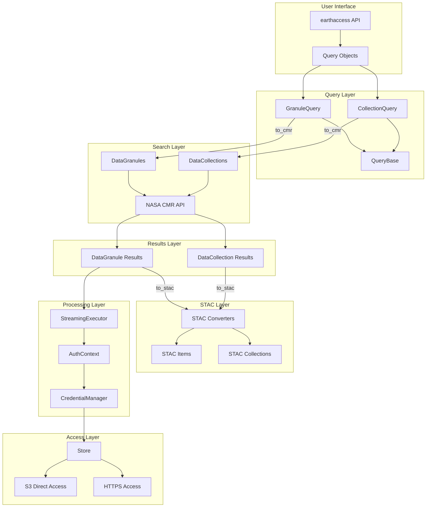
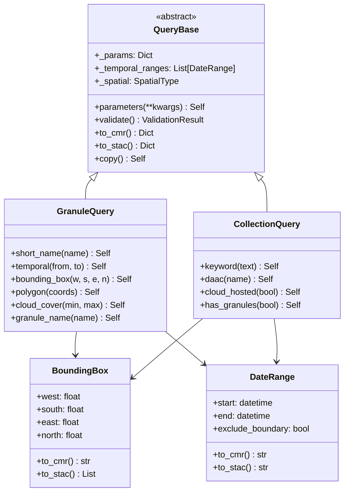
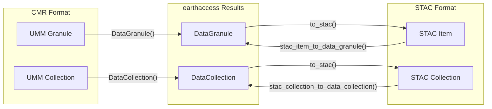
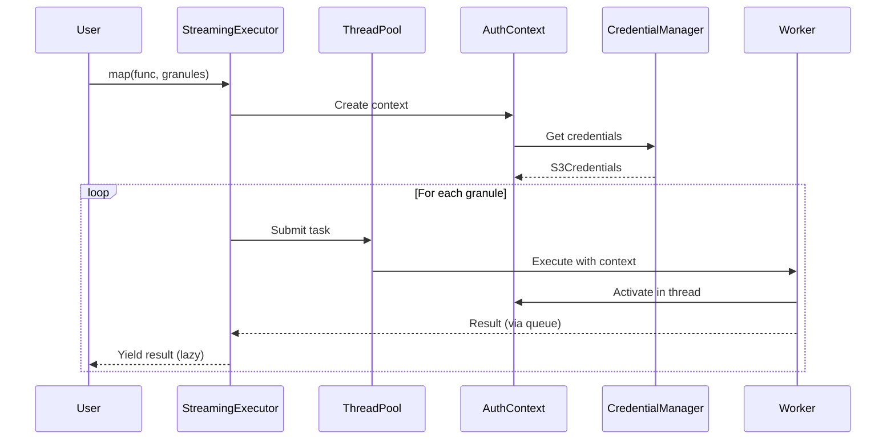
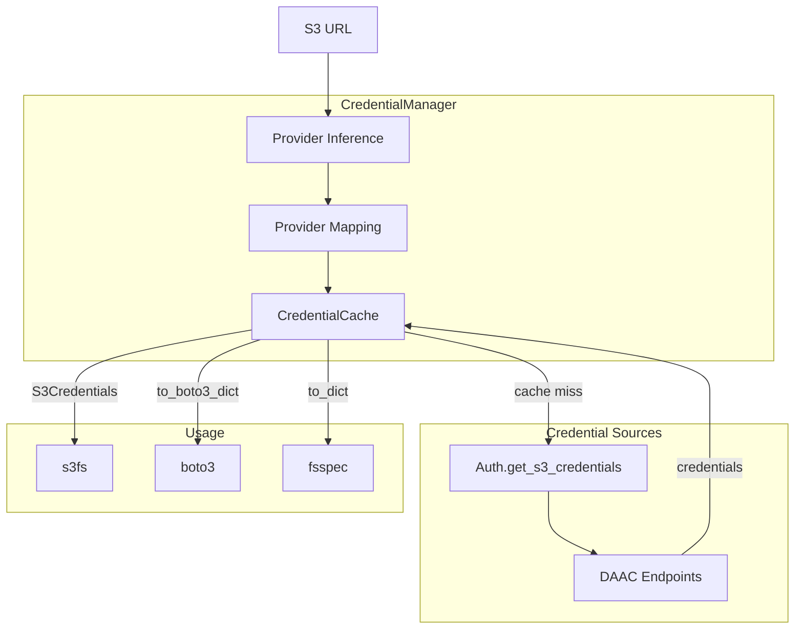
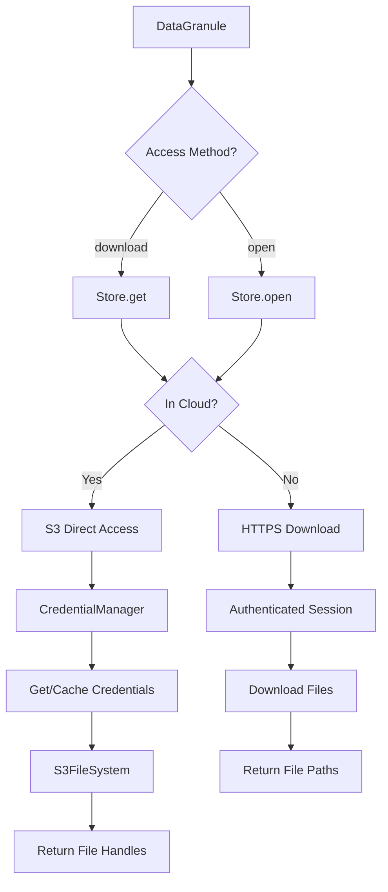

# Architecture

This document describes the architecture of earthaccess's query, STAC conversion, and streaming components.

## Overview

The earthaccess library provides a unified interface for searching, accessing, and processing NASA Earthdata. The architecture follows SOLID principles with clear separation of concerns.



## Component Architecture

### Query Layer

The query layer provides a fluent API for building search queries that can be converted to either CMR or STAC format.



### STAC Conversion Layer

The STAC layer provides bidirectional conversion between NASA CMR UMM format and STAC format.



### Streaming Execution Layer

The streaming layer enables lazy, memory-efficient processing of large result sets.



### Credential Management

The credential manager provides thread-safe, cached access to S3 credentials.



## Use Cases

### Use Case 1: Search and Download with Query Objects

```python
from earthaccess import GranuleQuery, search_data, download, login

# Authenticate
login()

# Build a query
query = (
    GranuleQuery()
    .short_name("ATL06")
    .temporal("2020-01-01", "2020-03-31")
    .bounding_box(-50, 60, -40, 70)
    .cloud_cover(0, 20)
)

# Validate before searching
validation = query.validate()
if not validation.is_valid:
    print(f"Query errors: {validation.errors}")
else:
    # Search and download
    granules = search_data(query=query, count=10)
    files = download(granules, "./data")
```

### Use Case 2: Convert Results to STAC for Interoperability

```python
import earthaccess
from pystac import ItemCollection

# Search for granules
granules = earthaccess.search_data(
    short_name="MUR-JPL-L4-GLOB-v4.1",
    temporal=("2024-01-01", "2024-01-07"),
    count=7
)

# Convert to STAC Items
stac_items = [g.to_stac() for g in granules]

# Create a STAC ItemCollection for use with other tools
item_collection = ItemCollection(items=stac_items)

# Save as GeoJSON
with open("granules.json", "w") as f:
    f.write(item_collection.to_dict())
```

### Use Case 3: Stream Processing Large Datasets

```python
from earthaccess import search_data, login
from earthaccess.streaming import StreamingExecutor, AuthContext
import xarray as xr

login()

# Search for many granules
granules = search_data(short_name="ATL06", count=1000)

# Create auth context for distributed processing
auth_context = AuthContext.from_earthaccess()

# Define processing function
def process_granule(granule):
    # This runs in a worker thread with credentials
    url = granule.data_links()[0]
    ds = xr.open_dataset(url)
    return ds.attrs.get("title", "Unknown")

# Stream results with backpressure
with StreamingExecutor(max_workers=4, auth_context=auth_context) as executor:
    for result in executor.map(process_granule, granules):
        print(result)
```

### Use Case 4: Credential Management for Direct S3 Access

```python
from earthaccess import login
from earthaccess.credentials import CredentialManager
import s3fs

login()

# Create credential manager
cred_manager = CredentialManager()

# Get credentials for a specific S3 URL
url = "s3://nsidc-cumulus-prod-protected/ATLAS/ATL06/..."
creds = cred_manager.get_credentials_for_url(url)

# Use with s3fs
fs = s3fs.S3FileSystem(**creds.to_dict())
with fs.open(url) as f:
    data = f.read(1024)
```

### Use Case 5: Building STAC-Compatible Search Queries

```python
from earthaccess import GranuleQuery
from pystac_client import Client

# Build query using earthaccess
query = (
    GranuleQuery()
    .short_name("HLSL30")
    .temporal("2023-06-01", "2023-06-30")
    .bounding_box(-122.5, 37.5, -122.0, 38.0)
)

# Get STAC parameters
stac_params = query.to_stac()
# {'collections': ['HLSL30'],
#  'datetime': '2023-06-01T00:00:00Z/2023-06-30T23:59:59Z',
#  'bbox': [-122.5, 37.5, -122.0, 38.0]}

# Use with a STAC API client
catalog = Client.open("https://cmr.earthdata.nasa.gov/stac")
search = catalog.search(**stac_params)
items = list(search.items())
```

## Data Flow

### Search Flow

```mermaid
flowchart LR
    A[User Query] --> B{Query Type?}
    B -->|kwargs| C[Direct to CMR]
    B -->|GranuleQuery| D[Validate]
    D --> E[to_cmr()]
    E --> C
    C --> F[DataGranules/DataCollections]
    F --> G[CMR API Request]
    G --> H[UMM JSON Response]
    H --> I[DataGranule/DataCollection Objects]
    I --> J[Return to User]
```

### Access Flow



## Extension Points

The architecture is designed to be extensible:

1. **New Query Types**: Extend `QueryBase` to create new query types
2. **Custom Converters**: Add new STAC conversion functions in `stac/converters.py`
3. **Processing Backends**: `StreamingExecutor` can be extended for Dask/Ray
4. **Credential Providers**: `CredentialManager` supports custom provider mappings
